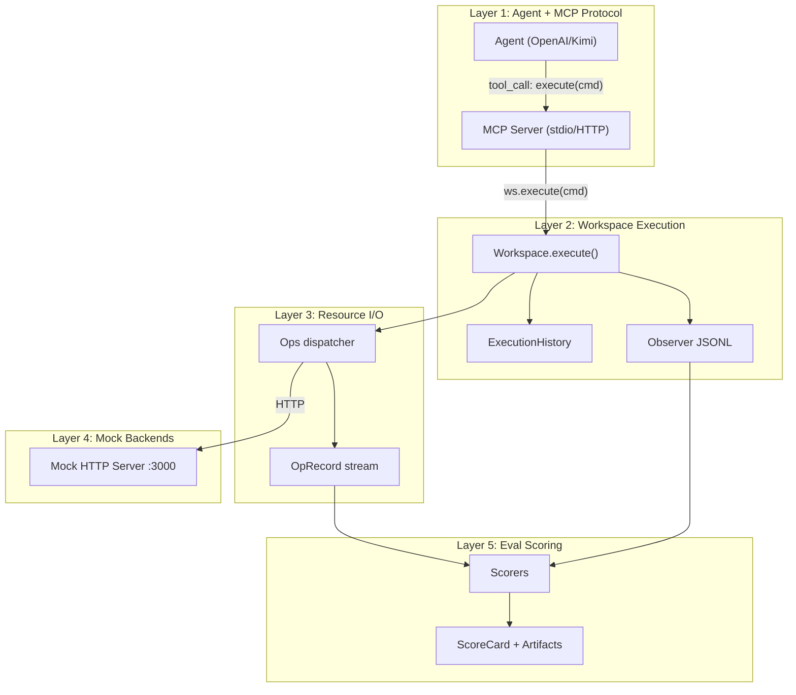
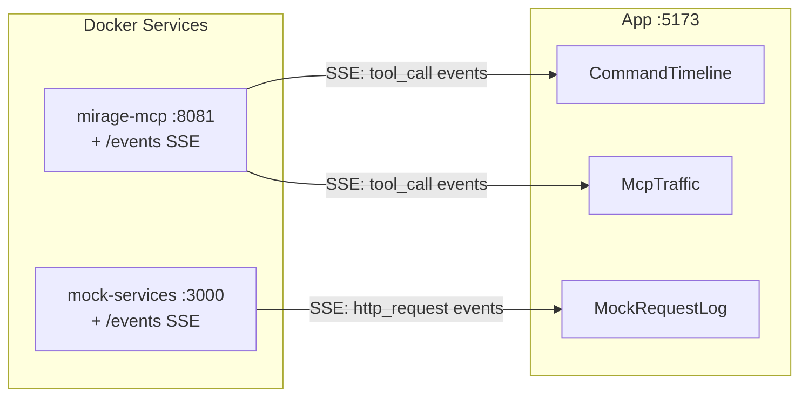

# Observability UI — Handoff Document

## What this UI is for

When an agent investigates an incident through Mirage, data flows through 5 layers. Today none of this is visible — you run the agent and get a final text blob. This UI makes the entire flow observable in real-time: what commands the agent ran, what data it read, what endpoints were hit, and how it scored.

## Architecture: Where data lives at each layer



---

## Layer 1: MCP Protocol Traffic

**What exists today:** Nothing logged. The `execute` tool in `enterprise/mirage_eval/mcp_server.py` receives commands and returns text — no instrumentation.

**What to instrument:** Wrap the `execute` tool to emit events:

```python
# Fields available per MCP tool call:
{
    "type": "mcp_tool_call",
    "timestamp": 1715759400000,       # epoch ms
    "tool": "execute",
    "arguments": {"command": "ls /pagerduty/incidents/triggered/"},
    "result": "INC-5521.json",        # truncated
    "result_bytes": 42,
    "duration_ms": 85,
    "error": null
}
```

**How to add:** Add a WebSocket or SSE endpoint to the MCP server that streams these events. The UI connects to `ws://localhost:8082/events` and renders them in real-time.

**Recommended file:** Add event emission to `enterprise/mirage_eval/mcp_server.py` around the `execute` function body (before/after `await _ws.execute(command)`).

---

## Layer 2: Workspace Execution (richest data source)

**What exists today:** Two recording systems, both already working:

### A. ExecutionHistory (in-memory, full fidelity)

File: `python/mirage/workspace/history.py`

Each command produces an `ExecutionRecord` with:

| Field | Type | UI use |
|---|---|---|
| `agent` | str | Who ran it |
| `command` | str | Full command text |
| `stdout` | str | **Full** decoded output (not truncated) |
| `stdin` | str or null | Piped input |
| `exit_code` | int | Color red/green |
| `timestamp` | float (seconds) | Timeline position |
| `session_id` | str | Group by session |
| `tree` | nested dict | **Parse tree** of pipes, &&, sub-shells |

The `tree` contains `ExecutionNode.to_dict()` with nested `children`, `records` (full `OpRecord` list per node including `mount_prefix`, `fingerprint`, `revision`), and per-node `stderr`.

**This is the best data source for a command timeline view.** It has everything: full stdout, stderr, exit code, timing, and the exact I/O ops each command triggered.

### B. Observer JSONL (persisted to /.sessions/)

File: `python/mirage/observe/observer.py`, `log_entry.py`

Written to `/.sessions/{YYYY-MM-DD}/{session_id}.jsonl`. Two line types:

**Op lines:**
```json
{"type":"op","agent":"mcp-server","session":"default","timestamp":1715759400000,"op":"read","path":"/pagerduty/incidents/triggered/INC-5521.json","source":"disk","bytes":1234,"duration_ms":2}
```

**Command lines:**
```json
{"type":"command","agent":"mcp-server","session":"default","timestamp":1715759400000,"command":"cat /pagerduty/incidents/triggered/INC-5521.json","exit_code":0,"stdout":"(first 4096 chars)"}
```

**Gaps:** JSONL `op` lines omit `mount_prefix`, `fingerprint`, `revision` (present in `OpRecord` but dropped by `LogEntry.from_op_record`). Command lines omit `stderr` and truncate `stdout` to 4096 chars.

### C. OpRecord (in-memory, per-execute batch)

File: `python/mirage/observe/record.py`

| Field | Type | UI use |
|---|---|---|
| `op` | str | read/write/stat/readdir/append/mkdir/unlink |
| `path` | str | Virtual path accessed |
| `source` | str | Resource type (disk, ram, s3, slack, etc.) |
| `bytes` | int | Data transferred |
| `timestamp` | int (epoch ms) | Timeline |
| `duration_ms` | int | Latency coloring |
| `mount_prefix` | str | Which service mount (/slack, /tickets, etc.) |
| `fingerprint` | str or null | Content hash |
| `revision` | str or null | Version pin |

Accessible at `workspace.ops.records` (list, grows per command).

---

## Layer 3: Mock Backend HTTP Traffic

**What exists today:** No request logging in `enterprise/docker/mock_server.py`.

**What to instrument:** Add FastAPI middleware that logs every request:

```python
# Fields per mock backend request:
{
    "type": "mock_request",
    "timestamp": 1715759400000,
    "service": "slack",              # derived from path prefix
    "method": "GET",
    "path": "/slack/api/conversations.history",
    "query": {"channel": "C001"},
    "status_code": 200,
    "response_bytes": 2048,
    "duration_ms": 3
}
```

**Stateful data already tracked:**
- `_posted_messages`: list of Slack messages the agent posted
- `_ticket_comments`: dict of Jira comments the agent added

These mutations are the key "write" events to surface.

---

## Layer 4: Eval Results (post-run)

**What exists today:** Full scoring pipeline writes JSON files.

### ScoreCard (`enterprise/mirage_eval/scorers/composite.py`)

```json
{
    "composite": 0.85,
    "passed_gates": true,
    "programmatic": {
        "gates": [
            {"name": "file_exists:/incident_report.md", "passed": true, "detail": ""},
            {"name": "must_contain:/incident_report.md:INC-5521", "passed": true, "detail": ""}
        ],
        "fraction_passed": 1.0,
        "all_passed": true,
        "by_category": {"file_exists": 1.0, "must_contain": 1.0}
    },
    "trajectory": {
        "n_turns": 7,
        "n_commands": 28,
        "n_ops": 45,
        "bytes_read": 15234,
        "cache_hit_rate": 0.12,
        "wallclock_s": 25.3,
        "tokens_in": 12000,
        "tokens_out": 3500,
        "cost_usd": 0.045,
        "within_budget": true
    },
    "judge": {
        "scores": {"root_cause_accuracy": 0.95, "evidence_grounding": 0.85},
        "rationale": {"root_cause_accuracy": "Correctly identified pool size change"},
        "weighted": 0.89
    },
    "failure_modes": []
}
```

### On-disk layout per run

```
results/<scenario>/<sweep_id>/
    sweep_metadata.json
    aggregate.json
    SUMMARY.md
    runs/
        l1__kimi-k2.6__incident_investigation__seed1/
            artifacts.json      # RunArtifacts (full)
            sessions.jsonl      # Observer JSONL
            output_files/       # Files agent wrote
            final_output.txt    # Agent's answer
            scorecard.json      # ScoreCard
```

---

## Recommended UI Views

### View 1: Live Command Timeline (primary view)

A vertical timeline showing every command the agent runs, in real-time.

```
[14:00:02] ls /                                          exit=0  85ms
           → datadog, dev, github, pagerduty, slack, tickets

[14:00:03] ls /pagerduty/incidents/triggered/            exit=0  12ms
           → INC-5521.json

[14:00:03] cat /pagerduty/incidents/triggered/INC-5521.json  exit=0  8ms
           → {"id":"INC-5521","title":"P99 latency > 2000ms...
           read /pagerduty 1.2KB

[14:00:05] ls /tickets/queues/ops/open/                  exit=0  5ms
           → OPS-1245__intermittent_502_errors...  OPS-1247__p99_latency...
```

**Data source:** ExecutionHistory or Observer JSONL streamed via WebSocket.

Each entry shows: timestamp, command, exit code (green/red), duration, truncated stdout, and a collapsed list of OpRecords showing which mounts were touched and bytes transferred.

### View 2: Resource Access Map

A visual showing the 6 workspace mounts as nodes, with edges drawn as the agent touches each one. Shows access order, read/write direction, and byte volume.

```
    /pagerduty --> /tickets --> /slack --> /github --> /datadog
       3 reads      2 reads     4 reads    3 reads     5 reads
       1.2KB        3.4KB       2.1KB      4.8KB       3.2KB
```

**Data source:** OpRecords grouped by `mount_prefix`.

### View 3: MCP Traffic Inspector

Side-by-side JSON-RPC request/response pairs. Shows the raw protocol.

**Data source:** Instrumented MCP server events (new).

### View 4: Mock Backend Request Log

Table of HTTP requests hitting the mock server, filterable by service.

| Time | Service | Method | Path | Status | Size | Duration |
|---|---|---|---|---|---|---|
| 14:00:03 | pagerduty | GET | /incidents?statuses[]=triggered | 200 | 1.2KB | 3ms |
| 14:00:05 | jira | GET | /rest/api/2/issue/OPS-1247 | 200 | 2.1KB | 4ms |

**Data source:** Mock server middleware (new).

### View 5: Eval Scorecard Dashboard

Already exists as a Cursor Canvas (`enterprise/mirage_eval/report/canvas.py`). Adapt to standalone React app showing composite scores, gate pass/fail, trajectory metrics, judge rubric scores, and failure modes.

**Data source:** `scorecard.json` and `aggregate.json`.

---

## Implementation Recommendation

### Tech stack

- **Frontend:** React + Vite (lightweight, fast refresh)
- **Backend:** The existing Docker stack + a thin event relay
- **Real-time:** WebSocket or SSE from instrumented MCP server + mock server
- **Post-run:** Read `results/` JSON files directly

### New files needed

```
enterprise/app/
    package.json
    vite.config.ts
    src/
        App.tsx                    # Layout: sidebar nav + main view
        components/
            CommandTimeline.tsx     # View 1: live command stream
            ResourceMap.tsx        # View 2: mount access visualization
            McpTraffic.tsx         # View 3: JSON-RPC inspector
            MockRequestLog.tsx     # View 4: backend HTTP log
            ScoreCardDashboard.tsx # View 5: eval results
        hooks/
            useEventStream.ts      # WebSocket/SSE connection
        api/
            client.ts              # Fetch from mock server + results/
```

### Backend instrumentation (Python side)

1. **`enterprise/mirage_eval/mcp_server.py`** — add an event buffer + SSE endpoint (`/events`) that streams tool call events
2. **`enterprise/docker/mock_server.py`** — add FastAPI middleware logging requests to an in-memory buffer + SSE endpoint (`/events`)
3. Both expose events at `GET /events` as SSE (Server-Sent Events) for easy browser consumption

### Docker integration

Add the app as a fourth service in `docker-compose.yml`:

```yaml
  app:
    build:
      context: enterprise/app
    ports:
      - "5173:5173"
    depends_on:
      - mock-services
      - mirage-mcp
```

### Data flow for real-time views



### Priority order

1. **Command Timeline** (View 1) — highest value, shows what the agent is doing in real-time
2. **Mock Request Log** (View 4) — validates the backend is being called correctly
3. **Scorecard Dashboard** (View 5) — already exists as Canvas, adapt to standalone
4. **Resource Map** (View 2) — nice visualization but lower priority
5. **MCP Traffic** (View 3) — useful for debugging protocol issues

---

## Key files to read before building

| File | Why |
|---|---|
| `enterprise/mirage_eval/mcp_server.py` | Where to add tool call event emission |
| `enterprise/docker/mock_server.py` | Where to add request logging middleware |
| `python/mirage/observe/record.py` | OpRecord shape (I/O data) |
| `python/mirage/observe/log_entry.py` | JSONL line shape (session journal) |
| `python/mirage/workspace/history.py` | ExecutionHistory + ExecutionRecord shape |
| `python/mirage/workspace/types.py` | ExecutionRecord.to_dict() + ExecutionNode.to_dict() |
| `enterprise/mirage_eval/scorers/composite.py` | ScoreCard shape |
| `enterprise/mirage_eval/report/aggregate.py` | AggregateReport shape |
| `enterprise/mirage_eval/report/canvas.py` | Existing Canvas dashboard (TypeScript types for scores) |
| `enterprise/docker/docker-compose.yml` | Service topology |
